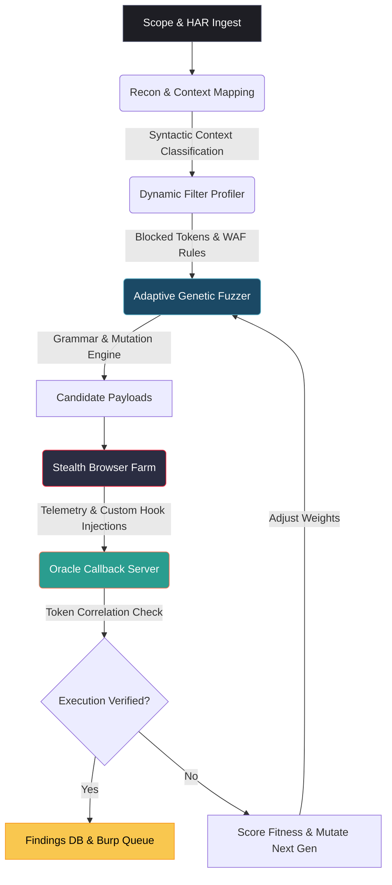
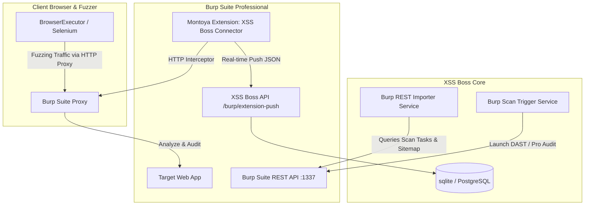

# XSSBOSS: The Next-Generation Agentic XSS Fuzzing & Verification Engine

> A feedback-driven security fuzzer designed to identify and verify Cross-Site Scripting (XSS) vulnerabilities with 100% accuracy and zero false positives.

XSSBOSS is a state-of-the-art DAST tool that treats vulnerability discovery as a feedback loop. Instead of spraying generic static payloads, it dynamically analyzes target sanitization rules, maps reflection syntax contexts, breeds optimized mutations, and verifies execution inside real headless browsers connected to a callback oracle.

---

## 🛠️ System Architecture & End-to-End Flow



---

## 📌 Deep-Dive: How XSSBOSS Works

### 1. Context-Aware Reflection Mapping
A single payload format cannot fit all targets. XSSBOSS classifies reflections into **5 distinct syntactic contexts** to determine breakout grammar:

| Context Type | Reflection Context | Breakout Pattern / Goal |
| :--- | :--- | :--- |
| `HTML_TEXT` | `<div>YOUR_INPUT</div>` | Breakout of text node with tags (e.g. `<svg>`, ``) |
| `ATTR_QUOTED` | `<input value="YOUR_INPUT">` | Escape quote and add event attribute (e.g. `" autofocus onfocus=...`) |
| `ATTR_UNQUOTED` | `` | Add space-delimited attributes directly (e.g. `x onerror=...`) |
| `JS_STRING` | `<script>var s = "YOUR_INPUT";</script>` | Escape quotes, terminate statement, inject custom code (e.g. `";__XSS__();//`) |
| `EVENT_HANDLER` | `<button onclick="YOUR_INPUT">` | Execute code directly without needing tag breakouts |

### 2. Active WAF Profiling & Adaptive Sorting
Before fuzzing, XSSBOSS executes a lightweight probe suite to determine:
*   Which tags are stripped or blocked (e.g., `<script>`, `<iframe>`).
*   Which event handlers are monitored (e.g., `onerror`, `onload`).
*   Which characters are neutralized (e.g., escaping `"` to `\"` or stripping parentheses `()`).

Instead of wasting test cycles on payloads bound to fail, **Filter-Aware Sorting** dynamically demotes all templates relying on blocked tokens. Templates completely free of blocked tokens are promoted to the front of the queue, maximizing fuzzing efficiency within limited time budgets.

### 3. Genetic Mutation Engine
When standard templates fail, XSSBOSS triggers its genetic breeder using four advanced mutation routines:
*   **Recursive Nesting**: Evades naive recursive string-stripping filters by generating nested constructs (e.g. `<scrscriptipt>` -> `<script>`).
*   **HTML Entity Obfuscation**: Translates protocols, tags, and symbols into entities (e.g., `javascript:` becomes `&#x6a;&#x61;...`) that bypass WAF rules but decode perfectly in the browser.
*   **Unicode Homoglyph Hunt**: Swaps characters with identical-looking Unicode homoglyphs to evade string-matching regex blocklists.
*   **Syntactic Call Rewrites**: When parentheses `()` are blocked, standard execution calls are dynamically rewritten to use tag-free template literals: `alert('xss')` $\to$ `alert`xss``.

### 4. Headless Browser Telemetry
XSSBOSS runs a highly optimized browser automation layer using Playwright/Selenium:
*   **Fingerprint Evasion**: Randomizes browser configurations, screen sizes, user-agents, and WebGL footprints to bypass automated bot detection.
*   **Custom DOM Instrumentation**: Overrides global functions (`console.log`, `alert`) and defines the `__XSS__(token)` callback interface.
*   **Tagged Template Literal Parser**: Intercepts tagged template literal breakouts (e.g. `__XSS__`TOKEN``) to extract the clean token and notify the oracle.

### 5. Verification Oracle (Zero False Positives)
Every candidate payload contains a cryptographically unique token. If the payload successfully executes in the browser, it calls the `__XSS__` handler, which issues an API call containing the token back to the Oracle server. A finding is registered **only** when the exact token matches a recorded execution, ensuring 100% verification accuracy.

---

## 🏆 Demonstration: The "Ultimate Boss" Level (`/hard/ultimate-boss`)

To demonstrate the power of XSSBOSS, we built a target endpoint `/hard/ultimate-boss` implementing the following defenses:
1.  **Recursive Sanitizer**: Recursively strips `script`, `iframe`, `img`, `onerror`, `onload`, `onbegin`, `onfocus`, and `javascript`.
2.  **Strict Character Filter**: Rejects quotes (`'`, `"`), backticks (`` ` ``), parentheses (`(`, `)`), and slashes (`/`, `\`).

### The Exploitation Flow:
XSSBOSS bypassed this defense automatically using **DOM Clobbering + HTML Entity Encoding**:

```html
<a id=config></a><a id=config name=url href=&#x6a;&#x61;&#x76;&#x61;&#x73;&#x63;&#x72;&#x69;&#x70;&#x74;:parent.__XSS__&#x28;&apos;{{TOKEN}}&apos;&#x29;>
```

1.  **Bypassing the Filter**: Since the payload uses HTML entities (e.g. `&#x6a;` for `j`), the backend python code sees no restricted characters and permits the injection.
2.  **DOM Clobbering**: The injected `<a>` elements clobber the global property `window.config` to become an `HTMLCollection`.
3.  **Vulnerable Sink**: The application's scripts try to dynamic-load an iframe using:
    `var f = document.createElement('iframe'); f.src = window.config.url;`
4.  **Implicit Conversion**: Accessing `window.config.url` retrieves the second anchor element, which the browser stringifies into its decoded `.href` property: `javascript:parent.__XSS__('TOKEN')`.
5.  **Execution**: The iframe executes the JS, communicating directly back to the parent window's callback hook.

---

## 🔌 Burp Suite Automation Integration

XSSBOSS supports deep, bidirectional integration with **Burp Suite Professional & Enterprise** to streamline penetration testing workflows.



*   **Live Telemetry (Montoya Extension)**: Streams HTTP proxy traffic in Burp Suite to the XSSBOSS target database in real time.
*   **Fuzzer Proxy Routing**: Routes fuzzer traffic through Burp Suite with automatic certificate bypassing (`--ignore-certificate-errors`) to capture fuzzing history.
*   **Burp REST API Integration**:
    *   *Sitemap Fetching*: Synchronizes sitemaps and normalized parameters.
    *   *Scan Task Control*: Launch, monitor, cancel, or delete active scans via the XSSBOSS UI dashboard.
    *   *Vulnerability KB*: Direct queries into the Burp Suite Issue definitions database.
*   **Offline Sitemap Upload**: Supports importing sitemaps via Burp Suite Target XML export files (with Base64-encoded request options enabled).

---

## ⚙️ Installation & Quick Start

### 1. Prerequisites
Ensure you have **Python 3.10+** and **Node.js** installed on your system.

### 2. Setup environment
Clone the repository and run the setup script:
```bash
git clone https://github.com/bluestmind/XSSBOSS.git
cd XSSBOSS
setup_backend.bat
```

### 3. Running a Test Campaign
To test the engine against the built-in lab targets:

1.  **Start Target & Callback Servers**:
    ```bash
    # Start target app (Flask/FastAPI on port 8099)
    python xss-lab/hard_mock_target.py
    
    # Start callback oracle receiver (port 8001)
    set PYTHONPATH=.
    python xss-lab/oracle_server/main.py
    ```
2.  **Launch the Fuzzer Campaign**:
    ```bash
    set PYTHONPATH=.
    python xss-lab/tools/run_hard_lab_e2e.py --skip-controls --reset
    ```

---

## 📄 License & Disclaimer
This project is created for authorized penetration testing, security auditing, and educational use only. Inspecting systems without prior consent is illegal.
