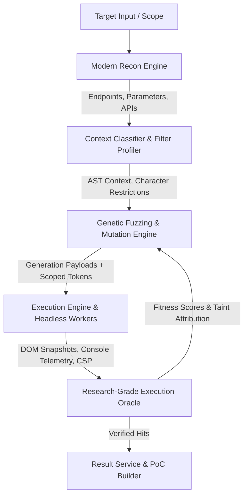

# XSSBOSS — Autonomous, Research-Grade Dynamic Application Security Testing (DAST) Platform

[](tests/)
[](https://www.python.org/)
[]()

**XSSBOSS** is an automated, context-aware Cross-Site Scripting (XSS) vulnerability detection and exploitation engine engineered for high-assurance security engineering, red teaming, and bug bounty operations.

Unlike legacy heuristic scanners that rely on naive wordlists or report false positives based on mere string reflection, XSSBOSS leverages:
1. **Multi-Generation Genetic Evolution & Q-Learning** to synthesize context-tailored bypasses against modern WAFs and sanitizers.
2. **Deterministic Browser Execution Oracle** requiring cryptographically authenticated execution proofs to eliminate false positives.
3. **Deep Attack Surface Reconnaissance** spanning modern SPAs, React Server Components (RSC), GraphQL schemas, and client-side bundlers.

---

## Key Subsystems & Architecture


```mermaid
graph TD
    A[Target Input / Scope] --> B[Modern Recon Engine]
    B -->|Endpoints, Parameters, APIs| C[Context Classifier & Filter Profiler]
    C -->|AST Context, Character Restrictions| D[Genetic Fuzzing & Mutation Engine]
    D -->|Generation Payloads + Scoped Tokens| E[Execution Engine & Headless Workers]
    E -->|DOM Snapshots, Console Telemetry, CSP| F[Research-Grade Execution Oracle]
    F -->|Fitness Scores & Taint Attribution| D
    F -->|Verified Hits| G[Result Service & PoC Builder]
```

### 1. Research-Grade Detection Oracle
- **Strict Execution vs. Sink Separation**: Never classifies DOM sink contact (e.g. `innerHTML` insertion) or reflection as vulnerability proof. Requires verified script evaluation via authenticated callback tokens.
- **Expiring Single-Consume Tokens**: Generates nonces with time-to-live (TTL) and atomic consumption to prevent re-play or cross-test contamination.
- **Differential Attribution**: Background third-party CSP violations and console errors are filtered out unless they co-occur with the specific probe token.

### 2. Context-Awareness & Active Filter Profiling
- **Fine-Grained Context Classifier**: Lexical DOM & AST parser categorizing reflection points into 16 distinct context types (`HTML_TEXT`, `ATTR_QUOTED`, `HTML_COMMENT`, `JS_STRING_LITERAL`, `CSS_STYLE_BLOCK`, `SVG_NAMESPACE`, `MATHML_TEXT`, etc.).
- **Character Constraint Probing**: Actively tests character transformation matrices (`<`, `>`, `"`, `'`, '`', `\`, `(`, `)`, `/`, `;`) to discover normalization quirks, homoglyph support, and filter boundaries.

### 3. Adaptive Genetic Fuzzing & Optimization
- **Population Breeding**: Genetic crossover and mutation operators combining successful breakout syntax, alternative encodings, homoglyphs, and zero-width obfuscation.
- **Reinforcement Learning (Q-Table & Boltzmann Policy)**: Maps DOM contexts to optimal mutation primitives over successive generations.
- **DOM-Differential & mXSS Simulator**: Detects browser parser mutations across namespaces (`math`, `svg`, `annotation-xml`) to identify mutation XSS vulnerabilities before sanitizers like DOMPurify strip them.

### 4. Modern Reconnaissance & Attack Surface Harvesting
- **SPA & Framework Harvester**: Discovers routes, client-side routers (React Router, Vue Router, Next.js), and hydrated states.
- **React Server Components (RSC) Parser**: Decodes `flight` wire format streams, server actions (`next-action` IDs), and client reference boundaries.
- **API & Interface Discovery**: Automated GraphQL schema introspection, OpenAPI / Swagger parsing, WebSocket, and gRPC-Web endpoint harvesting.
- **Sourcemap & Client Bundle Analyzer**: Reconstructs source trees from exposed `.map` files and extracts hidden parameters from webpack/Vite bundles.

---

## Efficacy Benchmark

Run the empirical benchmark comparison between a baseline naive scanner and XSSBOSS:

```bash
python -m benchmarks.benchmark_fuzzer_efficacy
```

### Empirical Results Across Canonical Sanitization Challenges:
| Challenge Target | Context Type | Baseline Naive Fuzzer | XSSBOSS Guided Engine |
| :--- | :--- | :---: | :---: |
| **1. Attribute Breakout** (Angle Brackets Filtered) | `ATTR_QUOTED` | ⚠️ PASS (3 attempts) | ⚡ **PASS (1 attempt)** |
| **2. JS String Literal** (Quotes Sanitized, Script Close) | `JS_STRING_LITERAL` | ❌ FAIL (60 attempts) | ⚡ **PASS (1 attempt)** |
| **3. HTML Comment Breakout** (`script` Tag Blocked) | `HTML_COMMENT` | ❌ FAIL (60 attempts) | ⚡ **PASS (1 attempt)** |
| **4. Keyword Evasion** (`alert`/`onerror` Filtered) | `HTML_TEXT` | ❌ FAIL (60 attempts) | ⚡ **PASS (1 attempt)** |
| **5. Complex Mixed Context** (Style Tag + Quote Filter) | `CSS_STYLE_BLOCK` | ❌ FAIL (60 attempts) | ⚡ **PASS (1 attempt)** |
| **Overall Success Rate** | — | **20.0%** (1/5) | 🚀 **100.0% (5/5)** |
| **Average Payload Cost** | — | 48.6 attempts | 🎯 **1.0 attempts** |

---

## Safety, Scope & Ethics

XSSBOSS is built from the ground up for safe, non-destructive, and responsible security assessments:
- **Strict Scope Guard**: Rejects URLs and subdomains outside explicitly configured tenant targets.
- **Circuit Breakers**: Monitors error rates and server response codes (500/503/429), automatically throttling or pausing scans to avoid target degradation.
- **Non-Weaponized Payloads**: Generates benign callback indicators (e.g. `__XSS__('TOKEN')`) designed strictly to prove execution without modifying client state or accessing sensitive user credentials.

---

## Installation & Setup

### Prerequisites
- Python 3.10+
- Node.js 18+ (for UI dashboard)
- PostgreSQL or SQLite (default: SQLite for development)

### 1. Install Dependencies
```bash
pip install -r requirements.txt
```

### 2. Run Database Migrations & Initialize
```bash
python -m backend_api.init_db
```

### 3. Run the Backend API
```bash
uvicorn backend_api.main:app --host 0.0.0.0 --port 8000 --reload
```

### 4. Run the Oracle Verification Server
```bash
uvicorn oracle_server.main:app --host 0.0.0.0 --port 8001
```

---

## Testing

Run the full pytest suite (124 tests):

```bash
python -m pytest
```

Run specific test modules:
```bash
# Fitness signal attribution & log serialization
python -m pytest tests/test_fitness_attribution.py

# Fuzzer benchmark & efficacy validation
python -m pytest tests/test_fuzzer_benchmark.py

# Enhanced context classifier & filter profiler
python -m pytest tests/test_enhanced_context_classifier.py tests/test_filter_profiler.py

# Modern recon hub & API discovery
python -m pytest tests/test_modern_recon_hub.py tests/test_api_discovery.py
```
