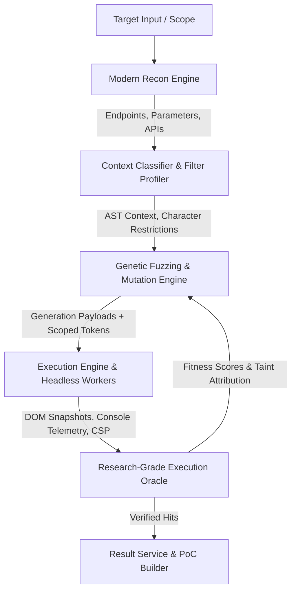

# XSSBOSS — Autonomous, Research-Grade Dynamic Application Security Testing (DAST) Platform

[](tests/)
[](https://www.python.org/)
[]()

**XSSBOSS** is an automated, context-aware Cross-Site Scripting (XSS) vulnerability detection and exploitation engine engineered for high-assurance security engineering, red teaming, and bug bounty operations.

Unlike legacy heuristic scanners that rely on naive wordlists or report false positives based on mere string reflection, XSSBOSS leverages:
1. **Multi-Generation Genetic Evolution & Q-Learning** to synthesize context-tailored bypasses against modern WAFs and sanitizers.
2. **Deterministic Browser Execution Oracle** requiring cryptographically authenticated execution proofs to eliminate false positives.
3. **Deep Attack Surface Reconnaissance** spanning modern SPAs, React Server Components (RSC), GraphQL schemas, and client-side bundlers.

---

## Key Subsystems & Architecture


```mermaid
graph TD
    A[Target Input / Scope] --> B[Modern Recon Engine]
    B -->|Endpoints, Parameters, APIs| C[Context Classifier & Filter Profiler]
    C -->|AST Context, Character Restrictions| D[Genetic Fuzzing & Mutation Engine]
    D -->|Generation Payloads + Scoped Tokens| E[Execution Engine & Headless Workers]
    E -->|DOM Snapshots, Console Telemetry, CSP| F[Research-Grade Execution Oracle]
    F -->|Fitness Scores & Taint Attribution| D
    F -->|Verified Hits| G[Result Service & PoC Builder]
```

### 1. Research-Grade Detection Oracle
- **Strict Execution vs. Sink Separation**: Never classifies DOM sink contact (e.g. `innerHTML` insertion) or reflection as vulnerability proof. Requires verified script evaluation via authenticated callback tokens.
- **Expiring Single-Consume Tokens**: Generates nonces with time-to-live (TTL) and atomic consumption to prevent re-play or cross-test contamination.
- **Differential Attribution**: Background third-party CSP violations and console errors are filtered out unless they co-occur with the specific probe token.

### 2. Context-Awareness & Active Filter Profiling
- **Fine-Grained Context Classifier**: Lexical DOM & AST parser categorizing reflection points into 16 distinct context types (`HTML_TEXT`, `ATTR_QUOTED`, `HTML_COMMENT`, `JS_STRING_LITERAL`, `CSS_STYLE_BLOCK`, `SVG_NAMESPACE`, `MATHML_TEXT`, etc.).
- **Character Constraint Probing**: Actively tests character transformation matrices (`<`, `>`, `"`, `'`, '`', `\`, `(`, `)`, `/`, `;`) to discover normalization quirks, homoglyph support, and filter boundaries.

### 3. Adaptive Genetic Fuzzing & Optimization
- **Population Breeding**: Genetic crossover and mutation operators combining successful breakout syntax, alternative encodings, homoglyphs, and zero-width obfuscation.
- **Reinforcement Learning (Q-Table & Boltzmann Policy)**: Maps DOM contexts to optimal mutation primitives over successive generations.
- **DOM-Differential & mXSS Simulator**: Detects browser parser mutations across namespaces (`math`, `svg`, `annotation-xml`) to identify mutation XSS vulnerabilities before sanitizers like DOMPurify strip them.

### 4. Modern Reconnaissance & Attack Surface Harvesting
- **SPA & Framework Harvester**: Discovers routes, client-side routers (React Router, Vue Router, Next.js), and hydrated states.
- **React Server Components (RSC) Parser**: Decodes `flight` wire format streams, server actions (`next-action` IDs), and client reference boundaries.
- **API & Interface Discovery**: Automated GraphQL schema introspection, OpenAPI / Swagger parsing, WebSocket, and gRPC-Web endpoint harvesting.
- **Sourcemap & Client Bundle Analyzer**: Reconstructs source trees from exposed `.map` files and extracts hidden parameters from webpack/Vite bundles.

---

## Efficacy Benchmark

Run the empirical benchmark comparison between a baseline naive scanner and XSSBOSS:

```bash
python -m benchmarks.benchmark_fuzzer_efficacy
```

### Empirical Results Across Canonical Sanitization Challenges:
| Challenge Target | Context Type | Baseline Naive Fuzzer | XSSBOSS Guided Engine |
| :--- | :--- | :---: | :---: |
| **1. Attribute Breakout** (Angle Brackets Filtered) | `ATTR_QUOTED` | ⚠️ PASS (3 attempts) | ⚡ **PASS (1 attempt)** |
| **2. JS String Literal** (Quotes Sanitized, Script Close) | `JS_STRING_LITERAL` | ❌ FAIL (60 attempts) | ⚡ **PASS (1 attempt)** |
| **3. HTML Comment Breakout** (`script` Tag Blocked) | `HTML_COMMENT` | ❌ FAIL (60 attempts) | ⚡ **PASS (1 attempt)** |
| **4. Keyword Evasion** (`alert`/`onerror` Filtered) | `HTML_TEXT` | ❌ FAIL (60 attempts) | ⚡ **PASS (1 attempt)** |
| **5. Complex Mixed Context** (Style Tag + Quote Filter) | `CSS_STYLE_BLOCK` | ❌ FAIL (60 attempts) | ⚡ **PASS (1 attempt)** |
| **Overall Success Rate** | — | **20.0%** (1/5) | 🚀 **100.0% (5/5)** |
| **Average Payload Cost** | — | 48.6 attempts | 🎯 **1.0 attempts** |

---

## Safety, Scope & Ethics

XSSBOSS is built from the ground up for safe, non-destructive, and responsible security assessments:
- **Strict Scope Guard**: Rejects URLs and subdomains outside explicitly configured tenant targets.
- **Circuit Breakers**: Monitors error rates and server response codes (500/503/429), automatically throttling or pausing scans to avoid target degradation.
- **Non-Weaponized Payloads**: Generates benign callback indicators (e.g. `__XSS__('TOKEN')`) designed strictly to prove execution without modifying client state or accessing sensitive user credentials.

---

## Installation & Setup

### Prerequisites
- Python 3.10+
- Node.js 18+ (for UI dashboard)
- PostgreSQL or SQLite (default: SQLite for development)

### 1. Install Dependencies
```bash
pip install -r backend_api/requirements.txt
```

### 2. Run Database Migrations & Initialize
```bash
alembic -c backend_api/alembic.ini upgrade head
```

### 3. Run the Backend API
```bash
uvicorn backend_api.main:app --host 0.0.0.0 --port 8000 --reload
```

### 4. Run the Oracle Verification Server
```bash
uvicorn oracle_server.main:app --host 0.0.0.0 --port 8001
```

### 5. Optional Burp Desktop auto-start (Windows)

When `BURP_ENABLED` and `BURP_AUTO_START` are true, the one-shot scan checks
Burp's local REST API. If Burp is not running, XSSBOSS starts the configured
official desktop JAR through Oracle `javaw.exe` (shown by Windows as
**Java(TM) Platform SE binary**) and waits for REST readiness before triggering
recon.

```dotenv
BURP_ENABLED=True
BURP_AUTO_START=True
BURP_EXECUTABLE="C:/Burp/burpsuite_desktop.jar"
BURP_JAVA_EXECUTABLE="C:/Program Files/Common Files/Oracle/Java/javapath/javaw.exe"
BURP_STARTUP_TIMEOUT_SECONDS=45
BURP_API_URL=http://127.0.0.1:13337
BURP_API_KEY=your-burp-rest-api-key
```

`GET /api/v1/burp/runtime` reports process/API state, and
`POST /api/v1/burp/runtime/start` starts it manually. Loader, keygen,
`-javaagent`, and `-noverify` startup paths are rejected.

### Authenticated and multi-identity campaigns

The one-shot `POST /api/v1/scans/` request accepts `auth_info` and an optional
`auth_identity`. Static headers/cookies/storage are applied to crawling, HTTP
probes, browser execution, and stored-XSS revisits. When a health check reaches
a login wall, the declared login flow runs and the request is retried once.

```json
{
  "url": "https://app.example/account",
  "authorized": true,
  "auth_identity": "author",
  "auth_info": {
    "default_identity": "author",
    "revisit_identities": ["admin"],
    "identities": {
      "author": {
        "role": "user",
        "cookies": {"session": "authorized-test-session"},
        "health_check_url": "/account",
        "login": {
          "url": "/login",
          "username": "authorized-test-user",
          "password": "authorized-test-password",
          "username_selector": "#email",
          "password_selector": "#password",
          "submit_selector": "button[type=submit]",
          "success_selector": "[data-testid=account-menu]"
        }
      },
      "admin": {
        "role": "admin",
        "cookies": {"session": "authorized-admin-session"}
      }
    },
    "workflows": [{
      "name": "create-and-view-draft",
      "identity": "author",
      "steps": [
        {"action": "navigate", "url": "/drafts/new"},
        {"action": "fill", "selector": "#title", "value": "xssboss_probe"},
        {"action": "click", "selector": "button[type=submit]"}
      ]
    }]
  }
}
```

Login `steps` may use `{{USERNAME}}` and `{{PASSWORD}}`. Cross-origin SSO is
blocked unless its exact origin is declared in `allowed_auth_origins`.
CAPTCHA, MFA, expired static sessions, anti-bot blocks, and failed workflows
pause safely instead of consuming scan budget. Read the queue at
`GET /api/v1/scans/{experiment_id}/interventions`; resolve it with refreshed
`auth_info` at
`POST /api/v1/scans/{experiment_id}/interventions/{intervention_id}/resolve`.
Target and endpoint API responses redact passwords, tokens, authorization
headers, and cookies. Target credentials and captured endpoint sessions are
encrypted at rest. Keep `SECRET_KEY` stable and backed up; rotate it only with
an explicit credential-data migration.

### Evidence-driven campaign brain

Autonomous scans use a closed observation loop instead of blindly draining a
static payload list:

1. Build explicit attack hypotheses from recon, context, taint, sink, filter,
   and impact evidence.
2. Score candidate actions by expected success, information gain, impact,
   reachability, learned technique performance, execution cost, and novelty.
3. Select a diverse batch across parameters and contexts.
4. After every browser result, confirm, pivot on partial sink/taint evidence,
   or deprioritize repeated negatives, then re-plan the next batch.

No-reflection is not treated as proof of safety. Three independent negative
techniques only saturate/deprioritize that exact context; only a verified oracle
hit or formal UNSAT proof is conclusive. The current choice, rationale, learned
outcomes, and bounded decision trace are returned as `campaign_brain` by
`GET /api/v1/research/experiments/{experiment_id}`.

#### Local WhiteRabbitNeo advisor through Ollama

The campaign brain can use a local model as a bounded advisor. The model sees
compact hypothesis metadata, may reorder only existing hypothesis IDs and
allowlisted techniques, and cannot create or execute network actions.

```dotenv
LLM_ENABLED=True
LLM_PREFER_LOCAL=True
LLM_API_URL=http://127.0.0.1:11434/api/generate
LLM_MODEL=WhiteRabbitNeo/WhiteRabbitNeo-V3-7B:latest
LLM_TIMEOUT_SECONDS=180
LLM_KEEP_ALIVE=30m
LLM_NUM_CTX=8192
LLM_MAX_OUTPUT_TOKENS=768
LLM_TEMPERATURE=0.2
LLM_CAMPAIGN_ADVISOR=True
LLM_MIDSCAN_ADVISOR=True
LLM_MIDSCAN_MAX_CALLS=8
LLM_MIDSCAN_MIN_CONFIDENCE=0.65
LLM_WORKFLOW_ADVISOR=True
LLM_WORKFLOW_MAX_CALLS=6
LLM_ALLOW_REMOTE_SECURITY_DATA=False
```

The advisor receives bounded, redacted evidence and learned technique outcomes. Its
recommendations only reorder already-authorized hypotheses/techniques; execution results
are attributed back to the advice under `campaign_brain.llm_advisor_performance`. Security
telemetry stays on Ollama unless `LLM_ALLOW_REMOTE_SECURITY_DATA=True` is explicitly set.
After a partial browser signal, the mid-scan advisor may boost exactly one already-pending
candidate. Decisions are cached per context/technique, capped per campaign, and their eventual
hit/signal reward is recorded under `campaign_brain.llm_pivot_performance`. Low-confidence
recommendations are rejected, and after four attributed executions the observed reward
automatically scales future LLM influence up or down.
Each override also records the deterministic candidate as a shadow baseline. If that candidate
later executes, `observed_reward_lift` reports the measured difference between LLM-selected and
baseline rewards instead of relying on a subjective intelligence score.

Sampled in-scope HTML forms are converted into real `Endpoint.custom_steps` before fuzzing.
Only exact action/method matches with safe selectors and STRICT non-destructive validation are
eligible. When multiple valid workflows remain, the local model chooses only among their IDs;
invalid model output falls back to deterministic coverage/step-count ranking.

Browser workers also collect bounded, value-free signals for triage. V8 precise
coverage records whether a statically identified trust boundary was reached. Runtime
causal lineage correlates source and sink event metadata and distinguishes timing-only
`causal_only` candidates from stronger `value_influence` evidence without retaining
observed values, source text, or URLs. An optional inert A/A/B coordinator can repeat a
GET query or fragment probe three times in isolated browser contexts. It upgrades a
candidate only when the two A observations are identical and B changes at the same
structural sink. Because the bounded sequence always runs A, A, then B, this result is
order-confounded: time, server state, or sequence effects can explain the B difference.
`value_influence` therefore raises a candidate's priority; it does not prove value flow,
script execution, or a vulnerability.

The worker HMAC-projects every fingerprint and seals the redacted projection against the
test-case ID, browser-attempt number, and coordinator series. The HMAC proves that the
trusted worker emitted that exact projection and detects modification or replay. It does
not certify hostile-page telemetry as true or complete. API, evidence, research, and LLM
paths reject unsealed, modified, or replayed value-influence reports.

Request-body, header, cookie, path, custom-step, stored-view, dynamic-auth,
action-like URL, and non-success response cases are ineligible. Existing static headers
and cookies are reused unchanged. Automatic A/A/B runs require Playwright mode
(`USE_UNDETECTED_CHROME=False`) so every arm receives a fresh browser context, plus
`CAPTURE_RUNTIME_LINEAGE=all` so misses from all arms are retained. Each arm permits one
same-origin, same-path top-level navigation and passive page-owned subresources only.
Active browser interactions and page networking APIs such as `fetch`, XHR, WebSocket,
workers, WebTransport, WebRTC, and beacons are blocked; service workers are disabled.
Wrong methods, cross-origin or subframe navigation, excess requests, a guard exception,
or any attempted blocked request invalidates the arm and prevents an upgrade.

A browser-native DOM
snapshot differential records
where the current probe marker was newly materialized, including flattened frame and
shadow-DOM structure. These signals raise or lower hypothesis priority; only the
execution oracle confirms XSS.

```dotenv
# all keeps evidence for positive and negative runs; hits retains positive runs only.
# Use off to disable collection.
CAPTURE_RUNTIME_COVERAGE=all
CAPTURE_RUNTIME_LINEAGE=all
# Fixed-order A/A/B is order-confounded prioritization evidence and adds exactly
# three GET navigations. It is disabled by default.
RUNTIME_LINEAGE_AAB_PROBES=False
# The HMAC authenticates the worker's redacted projection, not hostile-page truth.
# Change this identifier whenever SECRET_KEY is rotated; sealed lineage from a
# different key version is rejected instead of being silently re-attributed.
RUNTIME_LINEAGE_HMAC_KEY_VERSION=1
CAPTURE_DOM_DIFFERENTIAL=all
```

The configured first pass uses `smart_adaptive`, crawl depth 3, and 150
representative pages. Keep public proxy pools, forwarding-header spoofing, CSP
bypass, and insecure TLS disabled. Use a second targeted `max_coverage` pass
only for unresolved high-value contexts. In production, `ORACLE_SERVER_URL`
must be the browser-reachable HTTPS scanner origin that routes
`/api/v1/oracle` to the API; a container-local HTTP URL is blocked by HTTPS
targets as mixed content.

`GET /api/v1/research/llm/status` reports whether Ollama is reachable and the
configured model is installed. Structured tasks use Ollama JSON mode; if the
advisor is unavailable, the deterministic planner continues unchanged.

---

## Testing

Run the full pytest suite:

```bash
python -m pytest
```

Run specific test modules:
```bash
# Fitness signal attribution & log serialization
python -m pytest tests/test_fitness_attribution.py

# Fuzzer benchmark & efficacy validation
python -m pytest tests/test_fuzzer_benchmark.py

# Enhanced context classifier & filter profiler
python -m pytest tests/test_enhanced_context_classifier.py tests/test_filter_profiler.py

# Modern recon hub & API discovery
python -m pytest tests/test_modern_recon_hub.py tests/test_api_discovery.py
```
