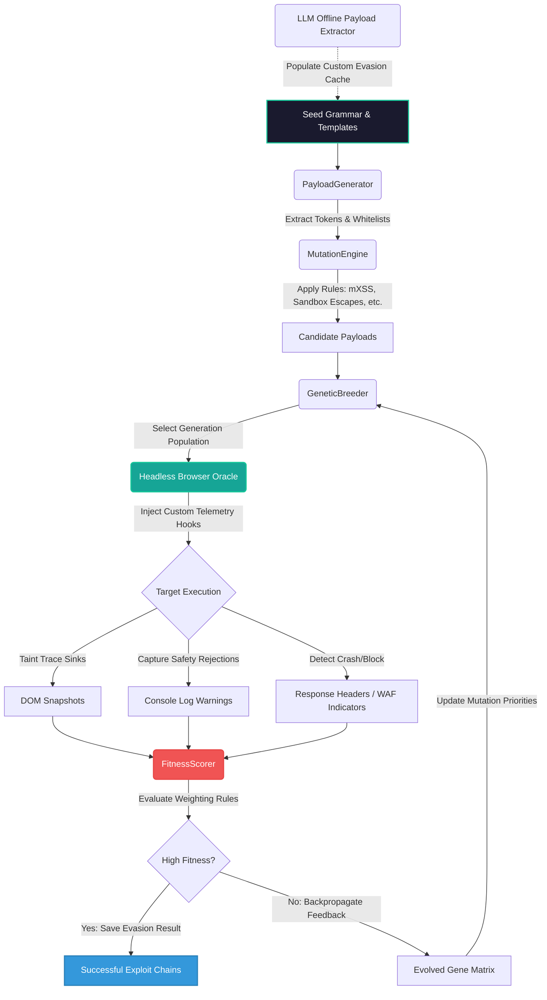
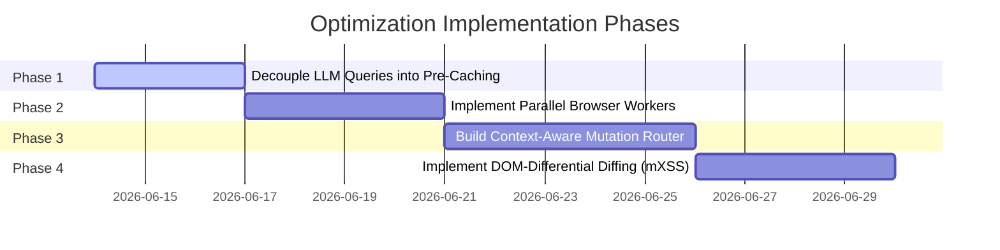

# Fuzzer Architecture Flow & Engineering Critique

This document provides a comprehensive view of the fuzzing engine's current system architecture, followed by an engineering critique highlighting the architectural limitations preventing optimal efficiency, and a roadmap to address them.

---

## 1. End-to-End Fuzzer System Flow

The diagram below illustrates the complete lifecycle of a payload—from seed selection, context-aware mutations, browser-driven evaluation, and telemetry scoring, to genetic breeding.

---

## 2. Engineering Critique: Bottlenecks & Limitations

To reach an optimized fuzzing loop, we must identify and address the following structural limitations in the current architecture:

### A. The Synchronous Browser Oracle Bottleneck
*   **The Problem:** Standard browser automation engines (`undetected_chromedriver` or Selenium instances) execute sequentially. Because real headless browser executions take hundreds of milliseconds to fully render, evaluate script contexts, and fire timeout triggers, running a genetic algorithm with dozens of generations and thousands of candidate payloads is extremely slow.
*   **Why it's not good:** A genetic algorithm thrives on large population pools and fast generations. Serial execution makes wide-coverage searches impractical.

### B. Context-Blind Mutation Strategy Selection
*   **The Problem:** The breeder selects mutations using static weights or random probabilities, regardless of the target response behavior. It does not analyze *why* a payload failed.
*   **Why it's not good:** If a target responds with a `Content-Security-Policy` header, the fuzzer should instantly pivot its mutation weight to CSP bypasses (e.g., CDN-hosted Angular templates). If it receives an HTTP `403 Forbidden` from a WAF, it should focus on character-set homoglyphs and obfuscations rather than DOM Clobbering. Static mutation matrices waste generations on irrelevant payloads.

### C. Inline LLM Evasion Queries
*   **The Problem:** The current logic allows the generator to fall back to `LLMService.generate_evasion_payloads` when local variants fail.
*   **Why it's not good:** Running remote API calls inside the real-time mutation and evaluation loop introduces network latency and risks rate limits or safety filter blocks mid-scan.

### D. Coarse-Grained Fitness Metric (mXSS Blind Spot)
*   **The Problem:** The `FitnessScorer` evaluates telemetry based on binary indicators (e.g., whether the test token reached a sink, or if console logs fired).
*   **Why it's not good:** It is blind to structural parser-differential shifts (mXSS). If the browser rewrites an input string into a different DOM subtree structure without executing Javascript immediately, a binary check registers this as a failure, missing potential parser-differential exploits.

---

## 3. Recommended Optimization Roadmap

### 1. Parallelization & Pre-filtering
*   Deploy a worker pool structure (using Python `multiprocessing` or asynchronous Selenium Grid bindings) to run browser evaluations in parallel.
*   Implement an offline, fast DOM parser emulation (using lightweight JS execution setups like Node/JSDOM) to pre-screen candidate payloads, filtering out syntax-invalid inputs before spinning up real browsers.

### 2. Context-Aware Adaptive Mutation Routing
*   Rewrite the generator loop to read initial target telemetry (WAF triggers, CSP headers, sanitizer footprints).
*   Dynamically adjust the mutation vector weights based on the target profile:
    *   **CSP Present:** Prioritize CDN references and scriptless template injection.
    *   **WAF Blocking:** Prioritize hex-entity normalization, comment breaks, and path/URL manipulations.
    *   **Sanitizer Script Stripping:** Prioritize DOM Clobbering configurations.

### 3. DOM-Differential Tracking
*   Introduce DOM tree serialization checks in the telemetry capture. The scorer should compare the raw payload syntax against the output of `document.body.innerHTML` post-parse to flag parser mutations (e.g., mismatched SVG/Math tags) even if no console warning executes immediately.
