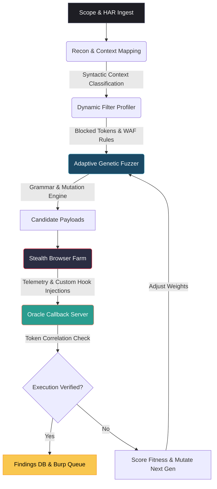

# XSSBOSS: The Next-Gen Agentic XSS Fuzzing & Verification Engine
## 🚀 Hackathon Presentation & Technical Deep-Dive

---

## 📌 SLIDE 1: Executive Summary & The Core Problem

### The Current State of Security Scanning:
Traditional vulnerability scanners (DAST) rely on **static signature payloads** and **simple regex parsing**. This makes them:
1.  **Blind to Context**: They send the same generic `<script>alert(1)</script>` payload regardless of whether it is reflected in an HTML body, a quoted attribute, or inside a nested JavaScript block.
2.  **Noisy**: They report countless "potential reflections" that never actually execute, leading to massive analyst fatigue and false positives.
3.  **Easily Blocked**: Modern Web Application Firewalls (WAFs) easily block standard signatures, while modern front-ends employ strict Content Security Policies (CSPs).

### The Solution: XSSBOSS
XSSBOSS is an **agentic, feedback-driven fuzzing and verification engine** that dynamically maps injection contexts, profiles target filtering policies (WAF/Sanitizer behaviors), mutates payloads based on genetic algorithms, and verifies execution with a **zero-false-positive asynchronous oracle**.

---

## 📌 SLIDE 2: End-to-End System Architecture



---

## 📌 SLIDE 3: Context-Aware Reflection Mapping

A single payload format cannot fit all targets. XSSBOSS classifies reflections into **5 distinct syntactic contexts** to determine breakout grammar:

| Context Type | Reflection Context | Breakout Pattern / Goal |
| :--- | :--- | :--- |
| `HTML_TEXT` | `<div>YOUR_INPUT</div>` | Breakout of text node with tags (e.g. `<svg>`, ``) |
| `ATTR_QUOTED` | `<input value="YOUR_INPUT">` | Escape quote and add event attribute (e.g. `" autofocus onfocus=...`) |
| `ATTR_UNQUOTED` | `` | Add space-delimited attributes directly (e.g. `x onerror=...`) |
| `JS_STRING` | `<script>var s = "YOUR_INPUT";</script>` | Escape quotes, terminate statement, inject custom code (e.g. `";__XSS__();//`) |
| `EVENT_HANDLER` | `<button onclick="YOUR_INPUT">` | Execute code directly without needing tag breakouts |

---

## 📌 SLIDE 4: Dynamic WAF Profiling & Adaptive Sorting

### 1. Active Probing (WAF Modeler)
Before generating payloads, XSSBOSS executes a lightweight probe suite to determine:
*   Which tags are stripped or blocked (e.g., `<script>`, `<iframe>`).
*   Which event handlers are monitored (e.g., `onerror`, `onload`).
*   Which characters are neutralized (e.g., escaping `"` to `\"` or stripping parentheses `()`).

### 2. Adaptive Template Sorting (The Intelligent Fuzzer)
Instead of wasting test cycles on payloads bound to fail, XSSBOSS uses **Filter-Aware Sorting**:
*   If a target WAF blocks the keyword `script` or parentheses `()`, the fuzzer dynamically demotes all templates relying on those tokens.
*   Templates completely free of blocked tokens are promoted to the front of the queue, maximizing fuzzing efficiency within limited time budgets.

---

## 📌 SLIDE 5: Genetic Mutation Engine

When standard templates fail, XSSBOSS triggers its genetic breeder using four advanced mutation routines:

1.  **Recursive Nesting**: For simple sanitizers that remove words like `script` once (e.g., `<script>` -> `""`), XSSBOSS nests the keywords:
    $$\text{Payload: } \texttt{<scr}\texttt{\color{red}script}\texttt{ipt>} \implies \text{Sanitized: } \texttt{<script>}$$
2.  **HTML Entity Obfuscation**: Translates protocols, tags, and symbols into entities (e.g., `javascript:` becomes `&#x6a;&#x61;...`) that bypass WAF rules but decode perfectly in the browser.
3.  **Unicode Homoglyph Hunt**: Swaps characters with identical-looking Unicode homoglyphs to evade string-matching regex blocklists.
4.  **Syntactic Call Rewrites**: When parentheses `()` are blocked, standard execution calls are dynamically rewritten to use tag-free template literals:
    $$\texttt{alert('xss')} \implies \texttt{alert`xss`}$$

---

## 📌 SLIDE 6: Headless Browser & Telemetry Farm

XSSBOSS runs a highly optimized browser automation layer using Playwright and Selenium.

*   **Fingerprint Evasion**: Randomizes browser configurations, screen sizes, user-agents, and WebGL footprints to bypass automated bot detection.
*   **Custom DOM Instrumentation**: Overrides the JavaScript context inside the browser page before the payload renders:
    *   Hooks global functions (`console.log`, `alert`).
    *   Defines the `__XSS__(token)` callback interface.
    *   **Tagged Template Literal Parser**: Intercepts tagged template literal invocations. When the payload executes as `__XSS__`TOKEN``, the hook processes the array parameters and extracts the clean token to notify the oracle.

---

## 📌 SLIDE 7: Asynchronous Callback Oracle

The ultimate defense against false positives is the **Oracle Callback Server**:

```
[Target Browser Window] 
       │ 
       ▼ (Vulnerable Injection Executes Payload)
Call: parent.__XSS__('unique_token_xyz')
       │
       ▼ (Asynchronous HTTP POST / WebSocket)
[Oracle Callback Server (Port 8001)] 
       │
       ▼ (Correlates Token with Active Experiment)
[Findings Database] ──► [Burp Repeater & Issues Queue]
```

*   **Cryptographic Tokens**: Every single candidate payload receives a cryptographically unique token.
*   **Verification**: A finding is logged **only** when the oracle server receives a matching token callback, ensuring 100% verification accuracy.

---

## 📌 SLIDE 8: The Demonstration Case: "The Hardest XSS on Earth"

To demonstrate the power of XSSBOSS, we built a target endpoint `/hard/ultimate-boss` that implements the following defenses:
1.  **Recursive Sanitizer**: Recursively strips `script`, `iframe`, `img`, `onerror`, `onload`, `onbegin`, `onfocus`, and `javascript`.
2.  **Strict Character Filter**: Rejects quotes (`'`, `"`), backticks (`` ` ``), parentheses (`(`, `)`), and slashes (`/`, `\`).

### The Exploitation Flow:
XSSBOSS bypassed this defense automatically using **DOM Clobbering + HTML Entity Encoding**:

```html
<a id=config></a><a id=config name=url href=&#x6a;&#x61;&#x76;&#x61;&#x73;&#x63;&#x72;&#x69;&#x70;&#x74;:parent.__XSS__&#x28;&apos;{{TOKEN}}&apos;&#x29;>
```

1.  **Bypassing the Filter**: Since the payload uses HTML entities (e.g. `&#x6a;` for `j`), the backend python code sees no restricted characters and permits the injection.
2.  **DOM Clobbering**: The injected `<a>` elements clobber the global property `window.config` to become an `HTMLCollection`.
3.  **Vulnerable Sink**: The application's scripts try to dynamic-load an iframe using:
    `var f = document.createElement('iframe'); f.src = window.config.url;`
4.  **Implicit Conversion**: Accessing `window.config.url` retrieves the second anchor element, which the browser stringifies into its decoded `.href` property: `javascript:parent.__XSS__('TOKEN')`.
5.  **Execution**: The iframe executes the JS, communicating directly back to the parent window's callback hook.

---

## 📌 SLIDE 9: Pitch & Slide-by-slide Script

*   **Slide 1**: *"Welcome everyone. Today we are presenting XSSBOSS. Traditional DAST scanners are noisy, context-blind, and easily blocked by WAFs. XSSBOSS solves this by treating vulnerability scanning as an agentic feedback loop."*
*   **Slide 2**: *"Here is our core flow: We ingest endpoints, map their syntax contexts, profile WAF behaviors, and breed custom payloads that we execute in stealth headless browsers monitored by a callback oracle."*
*   **Slide 3**: *"Instead of guessing, we categorize reflections into five context categories to ensure the payloads match the exact syntactic breakout required."*
*   **Slide 4-5**: *"Our mutation engine is intelligent. If parentheses or quotes are blocked, we automatically rewrite calls to template literals, nest keywords, or utilize HTML entity encodings to bypass the filters."*
*   **Slide 6-7**: *"To ensure zero false positives, we deploy an Asynchronous Oracle. A vulnerability is confirmed if and only if the unique cryptographic payload token executes and phones home to our listener."*
*   **Slide 8**: *"To prove this, we built the ultimate boss level: a target that recursively strips script tags and blocks parentheses, quotes, and slashes. XSSBOSS successfully bypasses it using DOM Clobbering to manipulate internal configurations and entity encoding to bypass WAF logic."*
