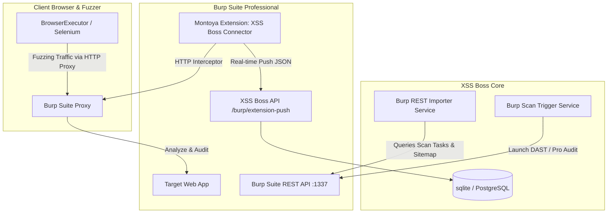

# Burp Suite Automation Integration Guide

XSS Boss supports deep, bidirectional integration with **Burp Suite Professional & Enterprise** to streamline bug bounty and penetration testing workflows. 

This guide details how to implement, configure, and operate Burp Suite within your automation cycle.

---

## 1. Integration Architecture Overview



---

## 2. Setting Up Live Telemetry (Montoya Extension)

The Montoya Extension (`XSS Boss Connector`) captures all scoped HTTP proxy traffic in Burp Suite and automatically streams it to the XSS Boss database in real time. This ensures that manually navigated pages or third-party crawler outputs are instantly mapped into the XSS Boss Target registry.

### Step 1: Directory Layout
Place the Montoya extension files in the `extensions/burp-montoya-extension` directory:
- `build.gradle` (Gradle configuration)
- `src/main/java/com/xssboss/extension/XssBossExtension.java` (Java source)

### Step 2: Build the Extension
Ensure you have [Gradle](https://gradle.org/) installed and run the following command in the extension directory:
```bash
gradle jar
```
This compiles a fat jar containing the compiled extension and Gson JSON dependencies at:
`build/libs/burp-montoya-extension-1.0.0.jar`

### Step 3: Load into Burp Suite
1. In Burp Suite, go to **Extensions** → **Installed**.
2. Click **Add**.
3. Set **Extension type** to **Java**.
4. Select the jar file located at `build/libs/burp-montoya-extension-1.0.0.jar`.
5. Check the Burp extensions console output to verify initialization.
6. A new tab named **XSS Boss** will appear in the main Burp navigation bar. Configure the API URL and active Target ID here.

---

## 3. Proxying Fuzzer Traffic through Burp Suite

By routing XSS Boss fuzzer traffic through Burp Suite, you combine the precision of client-side DOM-sink telemetry with Burp's active/passive vulnerability scanner and HTTP history logs.

### Step 1: Configure Proxy URL in Environment
To start the fuzzer browser worker with proxy options enabled, set the `PROXY_URL` environment variable:

- **Via `.env` file:**
  ```env
  PROXY_URL=http://127.0.0.1:8080
  ```
- **Via PowerShell:**
  ```powershell
  $env:PROXY_URL="http://127.0.0.1:8080"
  ```
- **Via Linux/macOS:**
  ```bash
  export PROXY_URL="http://127.0.0.1:8080"
  ```

### Step 2: Ignored Certificates
Because Burp acts as a decrypting proxy, the browser options automatically execute with `--ignore-certificate-errors` and `--allow-running-insecure-content`. This ensures that Selenium navigates HTTPS targets through Burp without certificate warning interruptions.

---

## 4. Querying Burp Suite REST API (Automated Imports & Scans)

XSS Boss interfaces directly with Burp's REST API. Enable the service in Burp Suite's global settings: **Settings** → **Suite** → **REST API**.

The integration supports full interaction with the native REST API endpoints (using both API key path authentication e.g. `/[API key]/v1/` and standard header bearer tokens):

### Feature 1: Scanned Sitemap Fetching
When configured, XSS Boss polls the Burp REST API at `http://127.0.0.1:1337/[API Key]/v1/scan`:
1. It fetches active and completed scan tasks.
2. It processes discovered sitemap URLs and request payloads.
3. It normalizes parameters (query, headers, body, JSON) and appends them to your target endpoint registry.

### Feature 2: Triggering DAST Scans
You can launch automated Burp Scanner audits for specific targets directly from the XSS Boss dashboard:
- Burp Suite spins up a headless browser, crawls target URL parameters, and performs security auditing.
- Findings are kept in Burp, and sitemaps are synchronized back to XSS Boss.

### Feature 3: Scan Task Control and Deletion (New)
- **Monitoring Progress:** View all active/finished scan tasks directly in XSS Boss with progress indicators and severity breakdowns.
- **Cancellation:** Instantly cancel and delete active scan tasks in Burp Suite using the `DELETE /v1/scan/{task_id}` endpoint.
- **Manual Syncing:** Trigger real-time findings synchronizations for specific scan tasks.

### Feature 4: Burp Knowledge Base Integration (New)
- Query the official vulnerability library of issue definitions from Burp Suite's knowledge base (`GET /v1/knowledge_base/issue_definitions`).
- Browse, search, and filter vulnerabilities to view their severity level and remediation instructions directly from within the XSS Boss dashboard.

---

## 5. Offline Sitemap Upload (XML Imports)

If you are running in a restricted or air-gapped network:
1. Right-click on any branch in Burp's **Target** → **Site map** tree.
2. Select **Save selected items**.
3. **Important:** Ensure the checkbox **Base64-encode requests and responses** is selected.
4. Go to the **Target Detail** page on the XSS Boss Dashboard, select the **XML Upload** tab, choose the exported `.xml` file, and upload it. All HTTP request paths and structures will import automatically.
